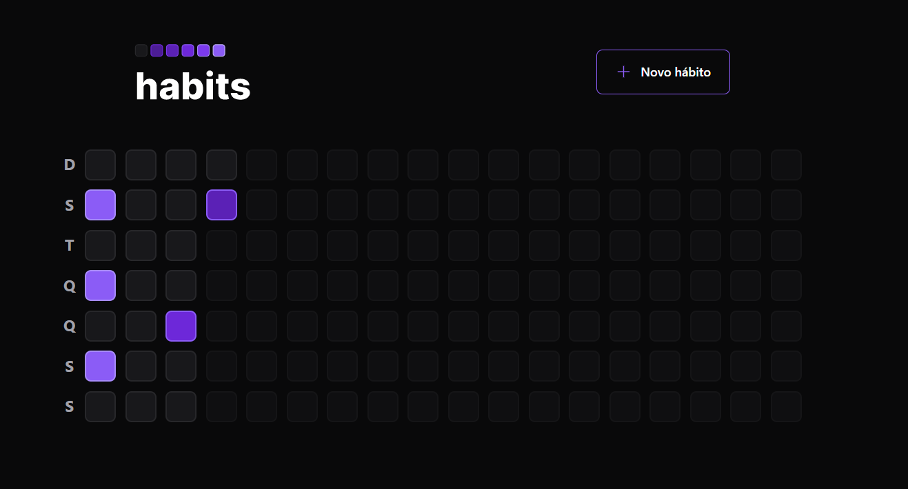
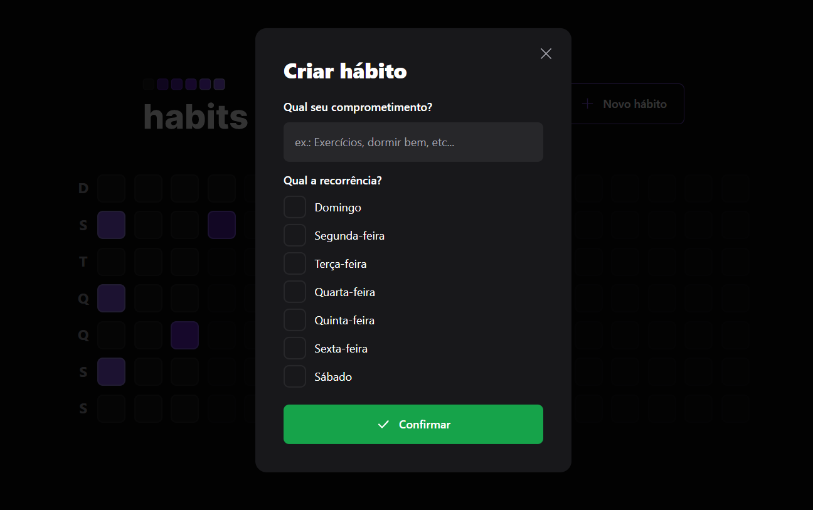
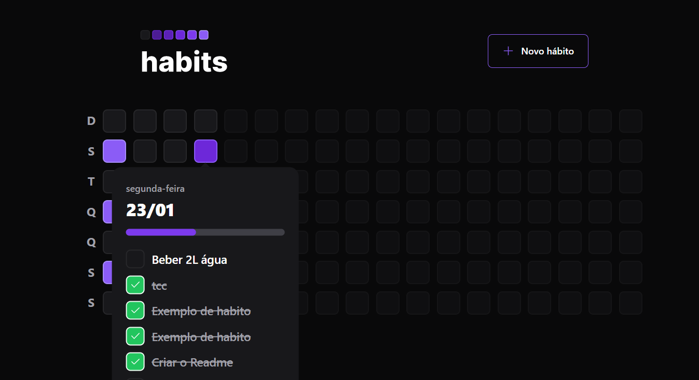

# Habits

<strong>Habits</strong> é uma aplicação de ponta a ponta para web e mobile criada no evento da <strong>Rockeatseat</strong> chamado "Next Level Week Setup" realizada na terceira semana de 2023. O caminho escolhido para esse projeto foi o ignite que abrange tecnologias como <em>TypeScript, NodeJs, React, React Native, SQLite e muitas outras bibliotecas e tecnologias, algumas delas podem ser vistas no "info.md"</em>.

<h2 > <strong>Sobre a aplicação:</strong> </h2>
Trata-se de uma aplicação onde o usuário pode controlar hábitos que deseja para o seu cotidiano

    

### Home

Em uma tela inicial o usuário é capaz de vizualizar todos os dias do ano até o momento. Cada quadrado representa um dia na semana e cor determina seu progresso em relação as tarefas do dia, ou seja, quanto mais claro mais tarefas foram concluídas no dia em questão

### New

No botão de novo hábito é possível criar um nova rotina e selecionar os dias que esse hábito deve ser realizado

### Hábito

Clicando em algum dia da tabela podemos ver as informações relacionadas aos hábitos daquele dia. Podendo marcar o hábito como realizado ou desmarcar

## Mobile

A aplicação tanto Web como Mobile consome o mesmo back-end, por isso as informações são as mesmas e as telas são bem parecidas

    

